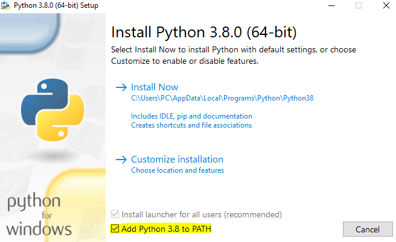
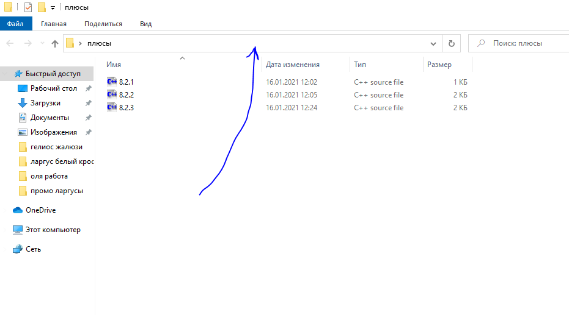
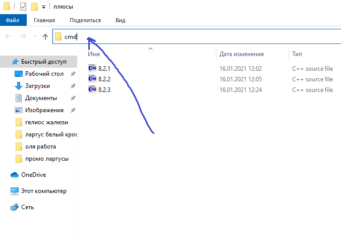

# Ссылки для скачивания

- [python](https://www.python.org/ftp/python/3.8.0/python-3.8.0-amd64.exe) Устанавливать с галочкой Add Python to PATH





- [git](https://github.com/git-for-windows/git/releases/download/v2.30.0.windows.2/Git-2.30.0.2-64-bit.exe)
- [nodejs](https://nodejs.org/dist/v14.15.3/node-v14.15.3-x64.msi)

# Открыть консоль
- Тыкнуть в клонированной папке здесь





- Стереть весь текст и написать `cmd`





- Нажать Enter

# Ввести команды в консоли

<details>
<summary>P.S.: Зачем виртуальное окружение</summary>


Виртуальное окружение нужно, чтобы у каждого питоновского проекта были **свои версии библиотек**.
Нужно из-за того, что питоновские библиотеки устанавливаются не конкретно для каждого проекта, а глобально
на компьютер, поэтому, чтобы у разных проектов были библиотеки разных версий, нужно делать виртуальное окружение.

Например, в одном проекте в виртуальном окружении может быть установлен **django 3 версии**, в то же время
в другом проекте может быть **django 2 версии**. А на самом компьютере глобально **вообще может не быть django**.


</details>

### Эти команды нужно вводить только после скачивания один раз

Создание виртуального окружения
```
python -m venv .venv
```
Активация виртуального окружения
```
.venv\Scripts\activate
```
Уже находясь в виртуальном окружении устанавливаем зависимости для бекенда
```
pip install -r requirements.txt
```
Установить зависимости для фронтенда
```
npm i
```

### Команды дальше нужно вводить при каждом запуске сайта

Запустить хот релоад для фронтенда (когда меняешь код страницы, она сразу обновляется в браузере).
Команда сама запустится в отдельной консоли
```
start cmd /k npm run hr
```
Активация виртуального окружения
```
.venv\Scripts\activate
```
Запуск сервера
```
python app\manage.py runserver
```
Теперь перейти по ссылке http://127.0.0.1:8000/

# Работа приложения в общих чертах  


# Сценарий действий клиента
1) Клиент заходит на сайт
2) Нажимает Начать Игру<br>
  a) Подключается к клиенту, который ожидает противника<br>
  b) Сам становится ожидающим
3) После подключения обоих случайным образом выбирается, кто будет ходить белыми<br>
  a) Клиент играет белыми, ходит и ожидает противника<br>
  b) Клиент играет черными, ждет, после получает координаты хода противника, обновляет позицию фигур и ходит
4) Повторение третьего шага
5) Сообщается результат игры<br>
  a) Выиграл<br>
  b) Проиграл
6) Предлагается начать игру заново
