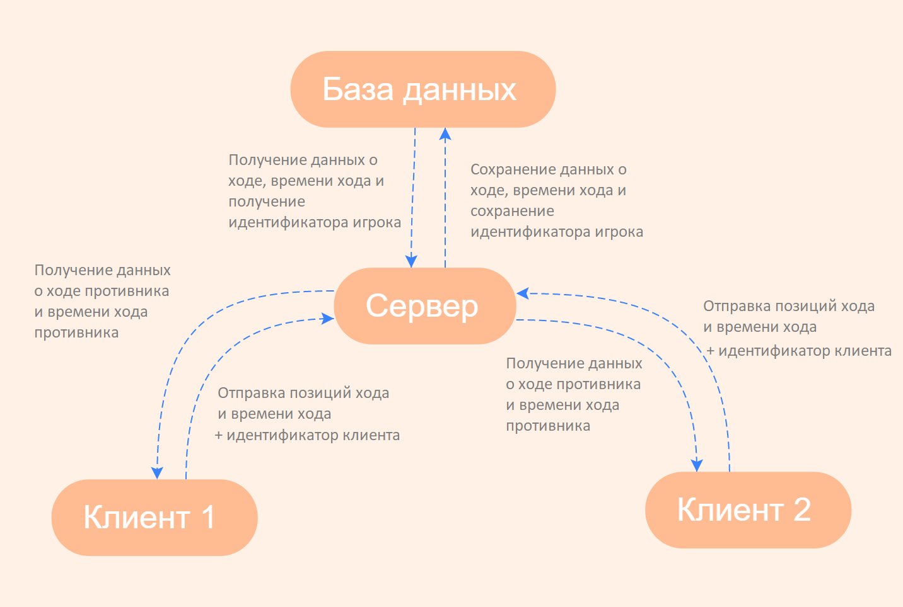

# Ссылки для скачивания
- [python 3.8](https://www.python.org/ftp/python/3.8.0/python-3.8.0-amd64.exe)
- [nodejs](https://nodejs.org/dist/v14.15.3/node-v14.15.3-x64.msi)

После клонирования репозитория запустить `deps.bat`

Чтобы запустить проект нужно запустить `run.bat` и перейти по ссылке http://127.0.0.1:8000/

# Работа приложения в общих чертах  

# Сценарий действий клиента
1) Клиент заходит на сайт
2) Нажимает Начать Игру 
  a) Подключается к клиенту, который ожидает противника 
  b) Сам становится ожидающим
3) После подключения обоих случайным образом выбирается, кто будет ходить белыми 
  a) Клиент играет белыми, ходит и ожидает противника 
  b) Клиент играет черными, ждет, после получает координаты хода противника, обновляет позицию фигур и ходит
4) Повторение третьего шага
5) Сообщается результат игры 
  a) Выиграл 
  b) Проиграл
6) Предлагается начать игру заново
